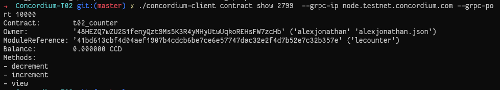

## Contract deployment Txn
 * ```dd17d8d93ec84ddb9afef3180ff104f166e4d28decc346f0d37a7a54f8190b0d```
 * 
## Contract initialization Txn: 
 * ```dbcadd0845e863aeb24cc041cf652005081318b11048c20d9c5c020386b1e966```
 * 
## Contract Update Txn
 * ```fc275ed061adcabd05aa755d4081fd89e53e6c7445fbf8aba49daf7a1d78df3e```
 * 
## Contract Invoke View
 * 

**Concordium Mainnet address:**
```2xBLr1bosK5NEQJTW9q1GHsmmuDgLrjAAzC8CSUBJc55AwVsw5```