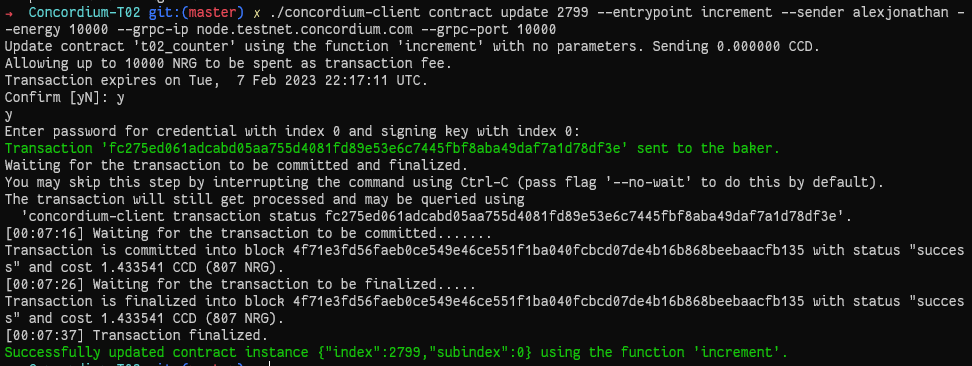

## Contract deployment Txn
 * ```ae207cb1324144e31016b490a6529df65a2ee2611cb0ed9734c2ff1d22c5ab48```
 * 
## Contract initialization Txn: 
 * ```16287125d6716af73231ac04f669d9f108772c4c60e00b6fdd613d674f90729d```
 * 
## Contract Update Txn
 * ```07ee7f0aacc9ebd1bd9b5b1bc775cb433f9f7dba75c0db9a6389ac24adb6408a```
 * 
## Contract Invoke View
 * 

**Concordium Mainnet address:**
```2xBLr1bosK5NEQJTW9q1GHsmmuDgLrjAAzC8CSUBJc55AwVsw5```